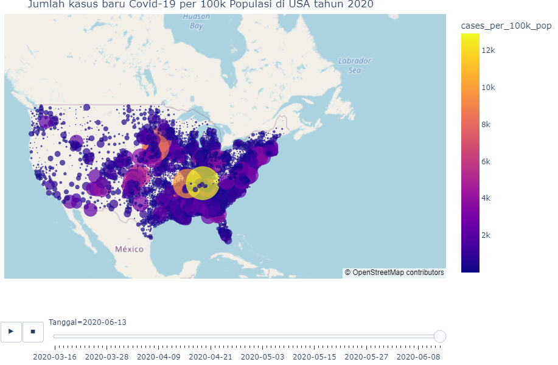
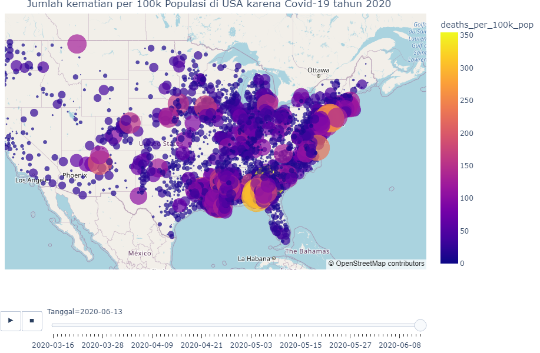

# NYTimes Covid 19 Analysis in 2020

_by Mohammad Attala Rajafar_

  

### Background

This data is data sourced from the NYTimes about the spread of Covid-19 in the United States of America (USA) in mid-2020, the purpose of making this data according to the table is to find out how much the spread of Covid-19 in the United States was in that year. This data consists of 2 files, namely:

Main Data:

- US Country (About the Spread of Covid, Cases, and Deaths, and total population)

Supporting data:

- US Population & Shapes (About Population and location description)

In this project, we describe analysis using the EDA method and visualization of spatial data related to the spread of Covid 19 in the United States in 2020 using python. The dataset used is a dataset of people from various regions (states) in the United States, and the features used are also related to society and covid 19.

### Here's a quick look at the data set features

**Variabel**

- date = _Tanggal_
- county = _Daerah_
- state = _Negara Bagian_
- fips = _Federal Information Processing Standard (ID dari Federasi Amerika Serikat)_
- state_fips = _ID untuk Negara Bagian_
- county_fips = _ID untuk Daerah_
- cases = _Kasus Covid-19_
- deaths = _Kematian akibat Covid-19_
- new_day_cases = _Kasus harian baru_
- new_day_deaths = _Kematian harian baru_
- cases_per_capita_100k = _Kasus perkapita/populasi 100k_
- deaths_per_capita_100k = _Kematian perkapita/populasi 100k_
- new_day_cases_per_capita_100k = _Kasus harian baru perkapita/populasi 100k_
- new_day_deaths_per_capita_100k = _Kematian harian baru perkapita/populasi 100k_
- county_pop_2019_est = _Estimasi populasi di daerah tahun 2019_
- pop_per_sq_mile_2010 = _Populasi per 16 Kilometer persegi tahun 2010_

  

The library used is as follows:

- geopandas
- numpy
- pandas
- folium
- matplotlib
- shapely
- plotly
- seaborn
