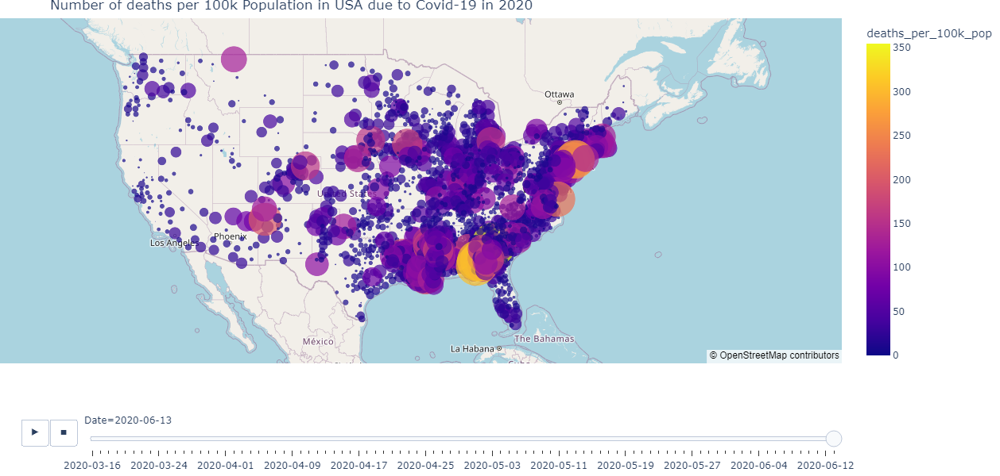
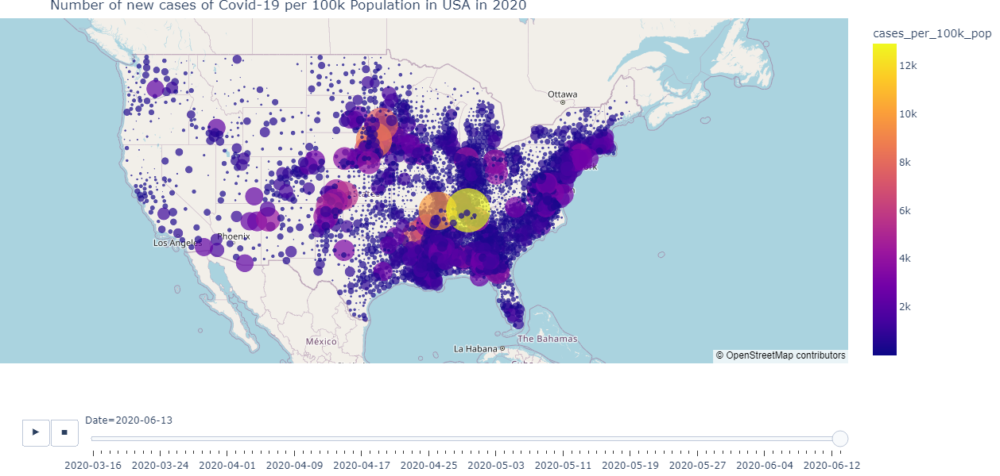

# NYTimes Covid 19 Analysis in 2020

by M. Attala R.

In this project, we describe analysis using the EDA method and visualization of spatial data related to the spread of Covid 19 in the United States in 2020 using python.

The dataset used is a dataset of people from various regions (states) in the United States, and the features used are also related to society and covid 19.

Here's a quick look at the data set features

  

The library used is as follows:
- geopandas
- numpy
- pandas
- folium
- matplotlib
- shapely
- plotly
- seaborn

Here are some of the output results

  

  